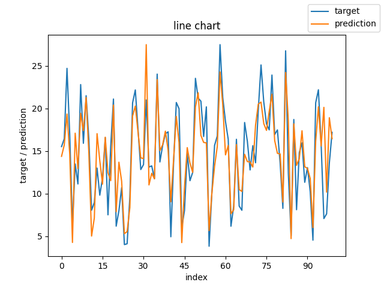
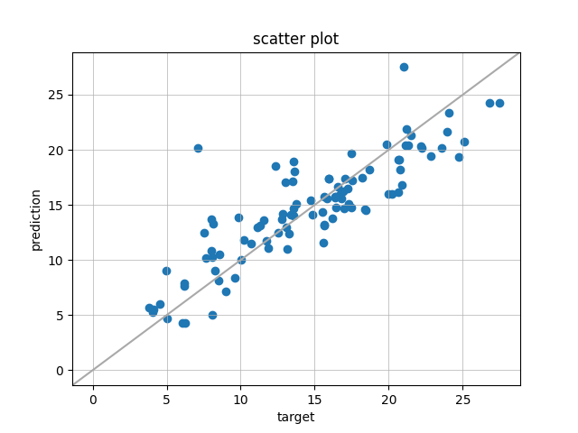
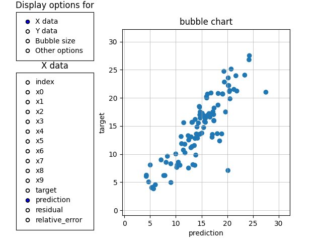
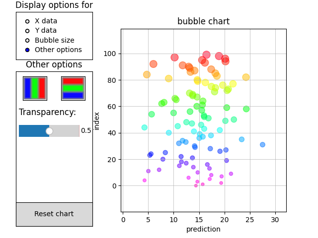
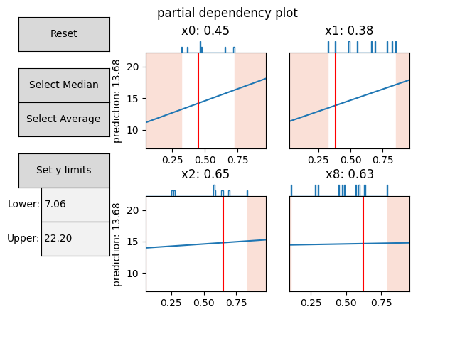

# scikit-charts

## Kurzfassung

Regressionsmodelle sind ein wichtiges Werkzeug in der Datenanalyse. Sie finden Anwendung bei der statistischen Vorhersage von Werten. Um die erstellten Regressionsmodelle zu Überprüfen werden Visualisierungen benötigt. Die Visualisierungen können entweder aus einer Bibliothek angewandt oder eigenständig für den Anwendungsfall entwickelt werden. Dabei stößt man jedoch häufig auf Einschränkungen. Diese betreffen schwere Integration in Projekte oder geringe Funktionalität und fehlende Interaktivität der Diagramme. Das Beheben dieser Probleme bedarf einer neuen Bibliothek zur Visualisierung von Regressionsmodellen. Das Ziel dieser Arbeit ist dabei die Entwicklung einer solchen Bibliothek, welche vier konkrete Diagramme beinhaltet. Diese sind Liniendiagramm, Streudiagramm, Blasendiagramm und Schnittdiagramm. Liniendiagramm und Streudiagramm finden häufig Verwendung und bieten einen einfachen Einstieg in die Entwicklung. Blasendiagramm und Schnittdiagramm bieten vielseitige Möglichkeiten der Interaktivität für die Anwender:innen. Ihre Implementierung bietet daher Einblicke zu den Schwierigkeiten die bei der Entwicklung komplexer Diagramme entstehen. Zur Entwicklung werden vier Bibliotheken verwendet: Matplotlib, Pandas und Scikit-learn. Die Arbeit beschreibt, wie diese Bibliotheken für die Entwicklung von Diagrammen eingesetzt werden. Als Ergebnis dieser Arbeit wird die fertige Bibliothek präsentiert. Die verfügbaren Diagramme erlauben komplexe interaktive Analysen, welche mit bestehenden Bibliotheken nicht möglich sind. Eine eigene, zeitaufwändige Implementierung ist dementsprechend nicht notwendig. Zuletzt wird noch ein Ausblick auf mögliche Erweiterungen der Bibliothek gegeben.

## Abstract

Regression models are an important tool in the field of data analysis. They are used for the statistical prediction of values. Visualizations are required, to validate these developed regression models. The visualizations are either used from an existing library or developed specifically for the use case. However, they often come with deficits. These involve hard integration into projects or low functionality and missing interactivity of the diagrams. Fixing these issues requires a new library for the visualization of regression models. The goal of this thesis is the development of such a library. It should include four specific diagrams. These are line chart, scatter plot, bubble chart and partial dependency plot. Line chart and scatter plot are commonly used diagrams which allows for a simple introduction into the development. Bubble chart and the partial dependence plot, on the other hand, offer rich interactivity to the users. Their implementation offers insights on the difficulties of creating complex diagrams. The development is based on four different libraries: matplotlib, pandas, and scikit-learn. How these libraries can be used for the development of diagrams is also outlined within the. The result of the thesis, is the presentation of the final library. The included diagrams allow for complex, interactive analysis, which are not possible with currently available libraries. This removes the requirement for a custom, time intensive implementation. The end of the thesis represents a possible outlook onto further extensions of the library.

## charts

